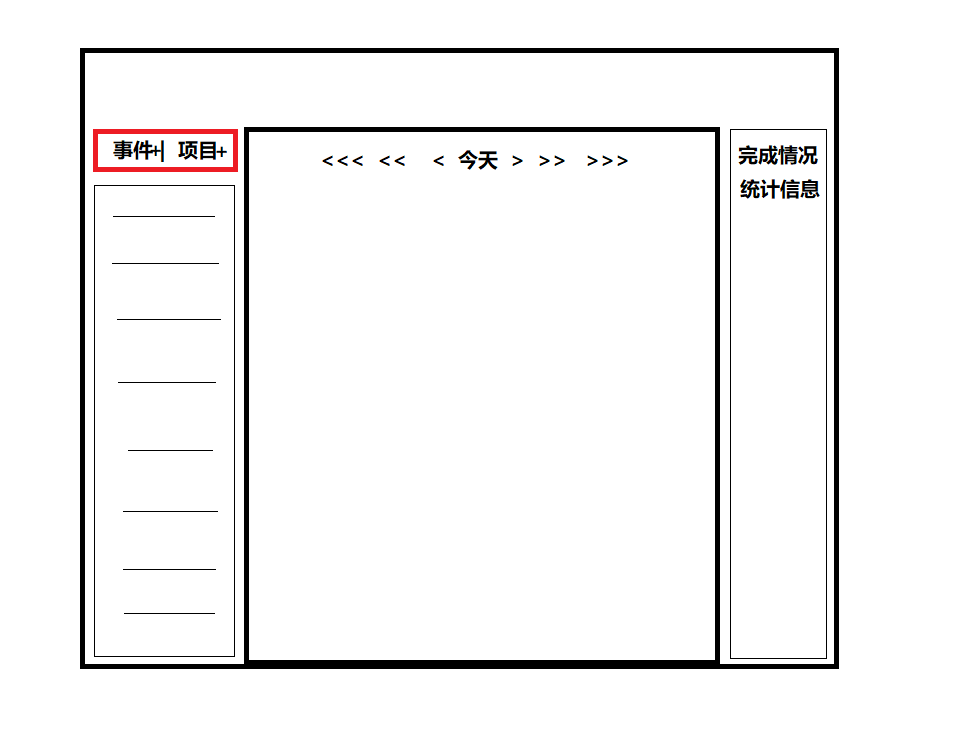

# 设计思想

## 事件
事件就是一个需要去完成的事情，有3要素组成【名称、时间、耗时】
## 调度
调度指的是时间的分配，可以针对事件，也可以针对项目。包括以下几种方式：
- 1 一次性
- 2 周期性
- 3 艾宾浩斯记忆分配

需要考虑几个特殊性：
- 1 节假日
- 2 周末
- 3 指定延后几天
## 项目
项目就是由多个事件组成。
## 视图
- 1 日视图
- 2 周视图
- 3 年视图
## 统计
- 1 统计每天/周/月的耗时
- 2 统计每天的完成情况
- 3 统计每个项目的完成情况

# 设计图

